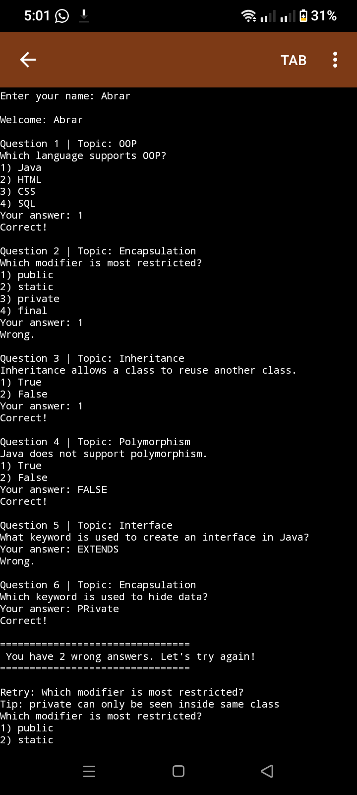
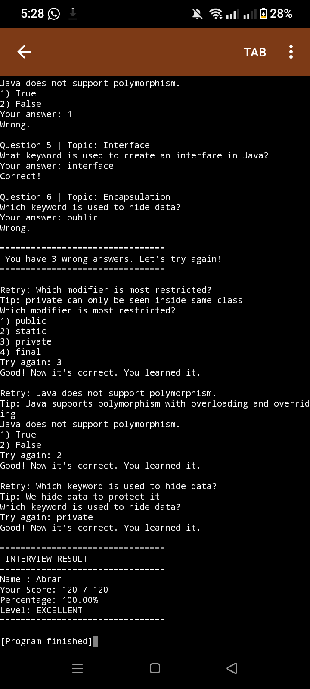

# Interview Forge Java

This is my Java OOP project.

## What is this project?
It is a small interview simulator that asks Java OOP questions and gives you a score at the end. If you answer wrong, it gives you a tip and lets you try again to learn.

## Features
- Ask MCQ, True/False, and Text questions
- Show tip when answer is wrong
- Retry wrong questions with tip
- Calculate score and percentage
- Show level EXCELLENT / VERY GOOD / GOOD

## OOP Concepts I used
- Interface: Score for points
- Abstract class: Question
- Inheritance: MCQQuestion, TrueFalseQuestion, TextQuestion extends Question
- Polymorphism: displayQuestion() and checkAnswer() different in each class
- Encapsulation: private variables with getters
- ArrayList to save questions

## How it works?
1. User enters name
2. Program asks 6 questions
3. If correct add points, if wrong save it
4. Retry wrong answers with tip
5. Show final result

## How to run?
Open Main.java in any IDE and run it.

## Output Screenshots

